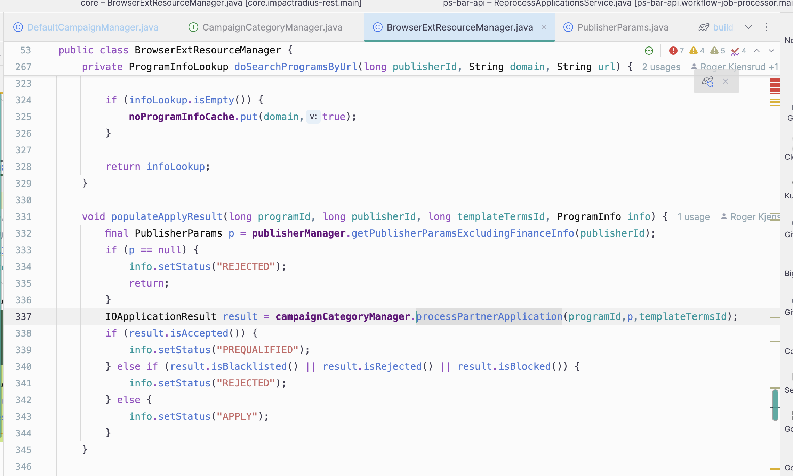

# Notes

# Week 1
### Todo
- [ ] 

### Questions to ask
- Problem: Add the DOE property to Campaign.generateApplicationResult().
- 1. add another parameter to campaignCategoryManager.processPartnerApplication(campaignId, publisherParams, existingPendingContract.getIoId());
  - But 
- 2. Make a call in generateApplicationResult to find DOE. Not sure where to call tho. Maybe CampaignManager?
### Done 
- 

# Week 2
### Todo
- [ ] 

### Questions to ask
- 

### Done 
- 

# Week 3
### Todo
PS_1471 - BAR TODO:
BarServiceTest, line 278:
    @Test
    void tesCheckApplicationReprocessingEnabled() throws Exception {

        when(barService.getBarApi()).thenReturn(barApi);
        var response = Mockito.mock(GetFeatureEnabledResponse.class);

        when(response.getFeatureEnabled()).thenReturn(true);
        when(barService.checkWorkflowFeatureEnabled(any(Feature.class))).thenCallRealMethod();
        when(barApi.workflowFeatureEnabled(any())).thenReturn(response);
        Assertions.assertTrue(barService.checkWorkflowFeatureEnabled(Feature.APPLICATION_REPROCESSING));
    }

### Questions to ask
- 

### Done 
- 

# Week 4
### Todo
- [ ] 

### Questions to ask
- 

### Done 
- 
