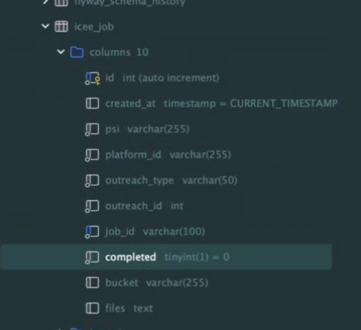
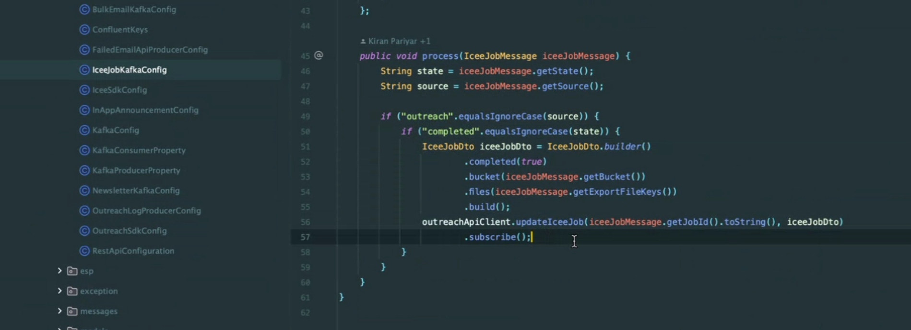
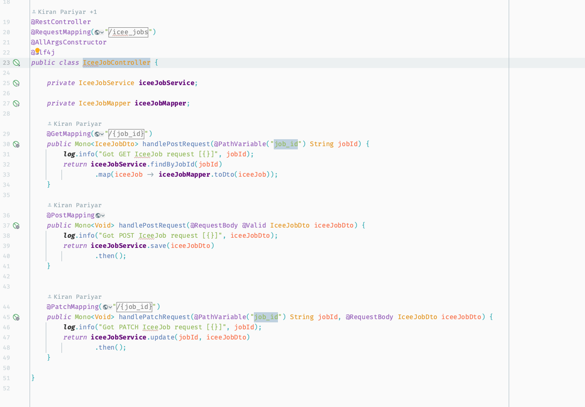
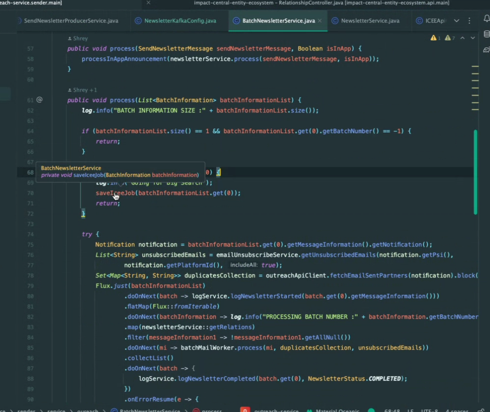

# Week 1
### Done 
#### Kafka Service breakdown

1. Sender is responsible for making a request to ICEE API and receive a JobID in response.
   1. sender/service/apis/ICEEApiObject.java implement specific ways to communicate to ICEE.  
      - postJob(SearchRelationshipRequest request, String trackingParams) sends the **BigSearch Query** and gets the JobID for Kafka queue.
      - fetchRelations(RecipientDto recipientDto, String psi) sends the normal query, gets the result and finish.
   2. iceeJobDto is being created but with empty value, waiting for the Kafka queue.

2. ICEE BigSearch will return a Kafka message, which is listened by sender/config/IceeJobKafkaConfig. runner() will check the message belongs to outreach, serialize the Kafka Record and acknowledge the queue, The IceeJobService will process the next step.

3. After the IceeJobService updates IceeJobDto, marks the job as completed, passes the bucket, and files into IceJobDto.

Somehow something called the service/api/controller/IceeJobController.java, and handlePatchRequest().

1. IceeJobService.UpdateIceeJob() saves job info to the Outreach database and also creates and populates the Newsletter-related Kafka queue.

2. IceeJobKafkaConfig will receive the Kafka record from step 5

3. BigSearchNewsletterService.batchRelations() will create a relationship from the file by using RelationshipReader

Quesitons:
- when we would receive multiple files?
- how do I make the request and what would the structure of response be?
- do we know if ICEE task is processing / down and not processing it / failed
- 

update once job is completed

ICEEJOB CONTROLLER

BIGSEARCH

   Questions:
   - Which files and classes would outreach call the ICEE and receive the JobID response? I assume there should be a datastructure to store all unfinished JobID(IceeJobRepository)? 
   - How can the same Kafka config be able to consume different Kafka topics?
   - How does IceeJobService know where to start/resume consuming different Kafka topic (I think maybe KafkaConsumerProperty, but how), check and match the consumed Kafka message with same JobID, and what happen if jobID does not match the ICEE response? Are the messages getting discarded?
   - Which part does IceeJobController play in the service breakdown(other than handlePatchRequest())? How is handlePatchRequest() method being called(I think it is between step 5 and 6)?

Check out the entity type in ICEE API

### Goal Next Week
1. 

### Todo
1. 

### Questions to ask
1. Ask Chris / Brett Multiple files - yes
2. WHere to store the ICEE job id internally(Probably MySQL)
3. Can ICEE tell me if Job failed? Would we receive a kafka message with failure message instead of files
4. Does the reactor project make the transaction ACID(Do we care about acknoledging it before processing it)
5. 

# Week 2
### Done 
1. Kafka Queue implementation

### Goal Next Week
1. 

### Todo
1. How to access secret and Google Secret Manager in java(ICEE)
2. Research API key to access BAR API, move away from mediarail
3. Orchestration by roger/workflow management
   1. https://github.com/ImpactInc/core/tree/4f16ce63dbc887a43c092d1f19c20163ad3ae624/impactradius-account/src/java/estalea/ir/workloadmgmt
   2. 

### Questions to ask

# Week 3
### Done 
1. 

### Goal Next Week
1. passing in workflowid, partner id, stage/node for evaluation to bar for evaluation
2. SDEITTEST test #36, request.setTrigger(Tigger.workflow)
3. Spock documentations

### Todo
1. 
2. Workflowid, partner id, stage/node for evaluation, 
3. SDEITTEST test #36, request.setTrigger(Tigger.workflow)

Big table groupby, aggregation

### Questions to ask

# Week 4
### Done 
1. 

### Goal Next Week
1. 

### Todo
1. 

### Questions to ask
