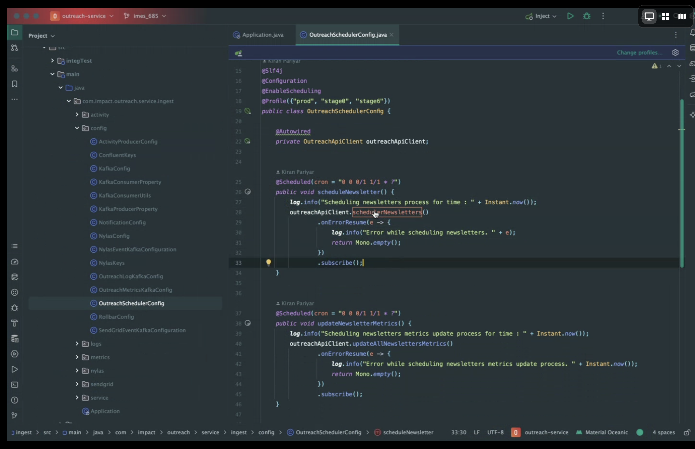
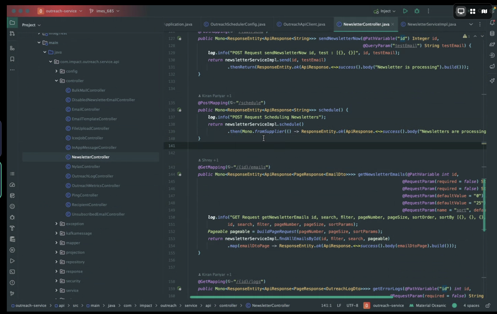
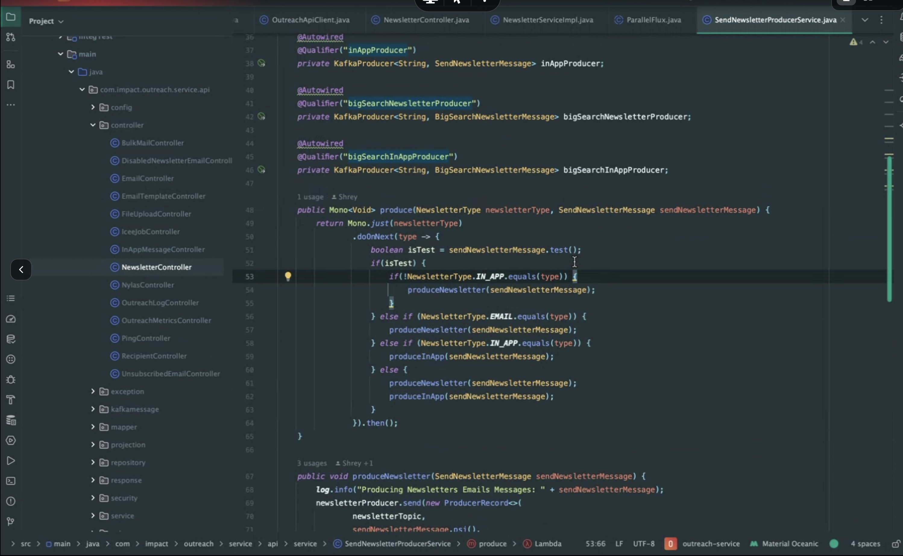
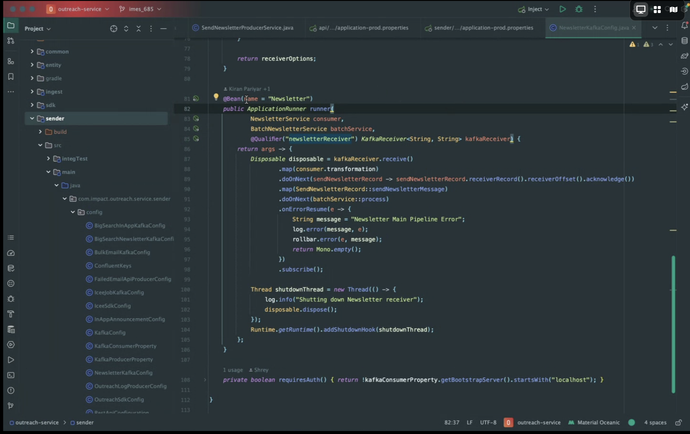
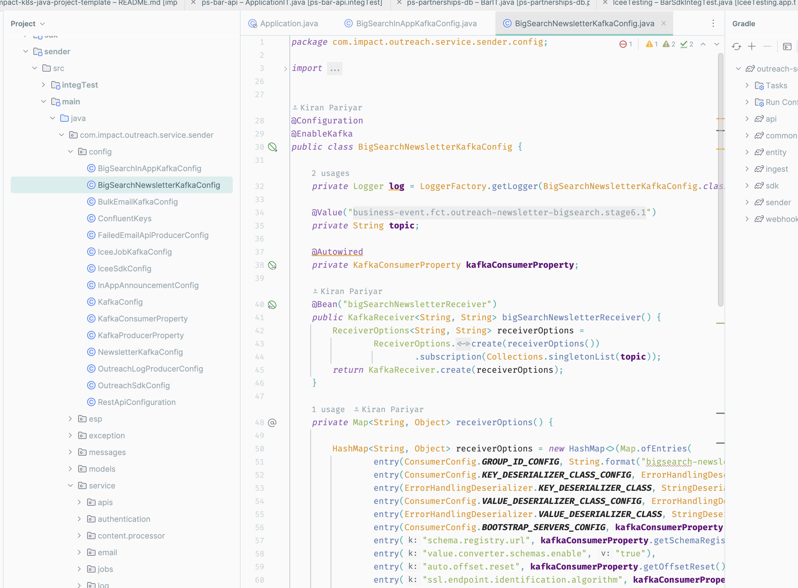
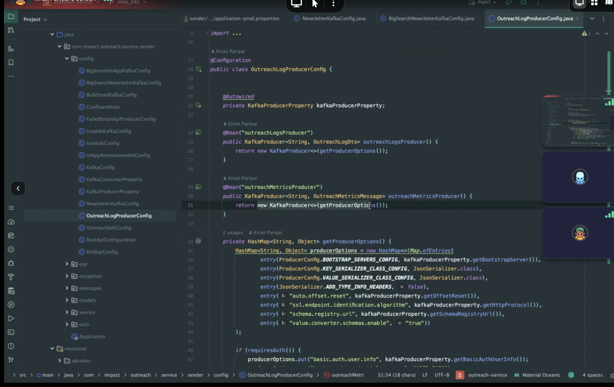
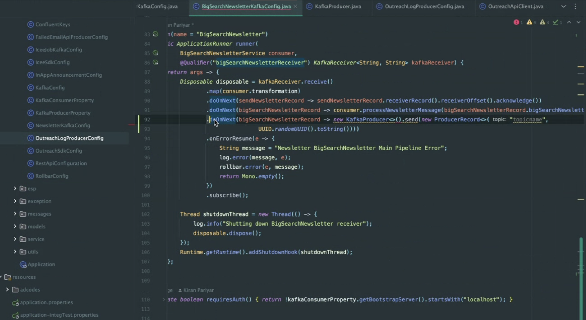

# Week 1
### Done 
1. 

### Goal Next Week
Email Orchestration workflow proxess
- Orchestration wakes up every hour
- Check whether the feature is on or off.
- (Call secret manager for API key for BAR)
- Call Bar to get segmentID for active schedules
- For each segmentID, Call ICEE and get jobID, manage Kafka queue retrieval and store the data
  - (multi thread or bulk trigger for messages we receive from Kafka) Need to decide because ICEE will return potentially millions of jobID upon hourly trigger.
- (query action item log and figure out which one have actions to be done)
- Call Bar for evaluation, return email templates, subject, actionID, (print & log content)
- Call action item log to update the emails we are going to send
- update Bar's processedAt
- send email to outreach
- Outreach send back result, we update actiona item log of success / false, and timestamp 

### Todo
1. Integrating Kafka with BAR api. (hold on to calling activity log) connect to emailSend
2. Secret manager

### Questions to ask
- Asyncronously process the ICEE resource or we run Kafka after that?
- Does ScyllaDB support 1000(10,000) emails in the where clause, or have a temp table that merges with ScyllaDB?
- ICEE is the biggest bottleneck, how do we solve that?
- 3 hours a good compromise?

# Week 2
### Done 
1. Testing BAR API

### Goal Next Week
1. 

### Todo
1. Ask Hans to teach me how do code reviews
2. Take a look at JWT
3. SQL triggers
4. Google Instance running the orchestrator service
5. 

### Questions to ask

# Week 3
### Done 
1. shell of Orchestrator into Bar, with K8s template
2. Talk to Devops to get it running
3. Call bar and pick a workflow
4. Fire to ICEE
5. Evvaluation from bar
6. send email to outreach

### Goal Next Week
1. 

### Todo
1. 

### Questions to ask

# Week 4
### Done 
1. 

### Goal Next Week
1. https://ocpj8.javastudyguide.com/ch08.html
2. https://ocpj8.javastudyguide.com/ch09.html
3. https://ocpj8.javastudyguide.com/ch10.html
4. https://ocpj8.javastudyguide.com/ch12.html
5. https://ocpj8.javastudyguide.com/ch16.html
6. https://ocpj8.javastudyguide.com/ch31.html
7. https://eherrera.net/project-reactor-course/03-working-with-map-and-flatmap/map.html

### Todo
1. å

### Questions to ask

every hour call this:
 ingest/src/main/java/com/impact/outreach/service/ingest/config/OutreachSchedulerConfig.java

 api/src/main/java/com/impact/outreach/service/api/controller/NewsletterController.java

kafka topic producer:
api/src/main/java/com/impact/outreach/service/api/service/SendNewsletterProducerService.java

Kafka Consumer:
 sender/src/main/java/com/impact/outreach/service/sender/config/NewsletterKafkaConfig.java

 sender/src/main/java/com/impact/outreach/service/sender/config/BigSearchNewsletterKafkaConfig.java

producer:

sender/src/main/java/com/impact/outreach/service/sender/config/OutreachLogProducerConfig.java

consumer+producer:
 sender/src/main/java/com/impact/outreach/service/sender/config/BigSearchNewsletterKafkaConfig.java